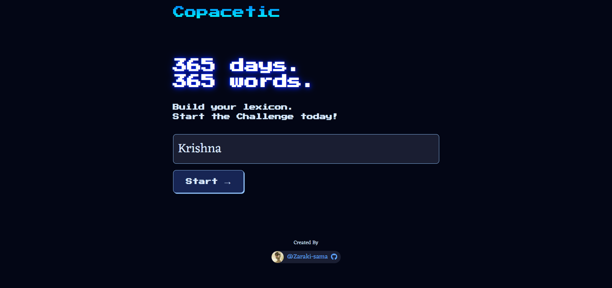
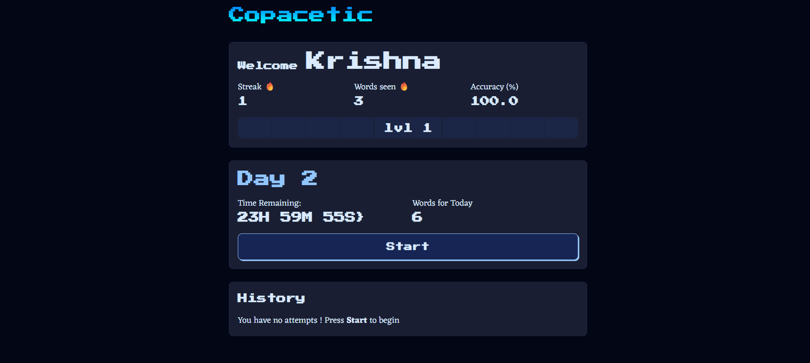
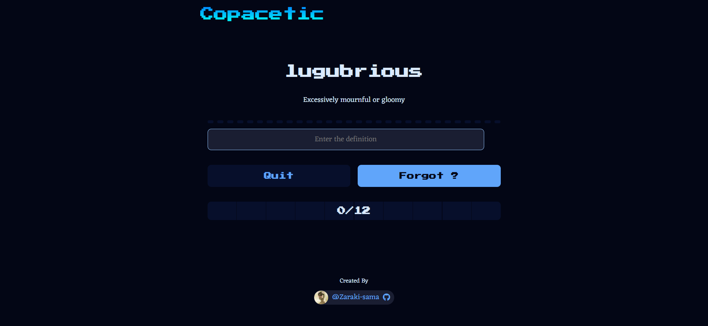

# Copacetic – Word Learning App

**Copacetic** is a  word learning application built with React and Vite. It uses spaced repetition algorithms to expand their vocabulary efficiently—one word a day, every day, for a year.

---

## Table of Contents

- [Overview](#overview)
- [Features](#features)
- [Demo](#demo)
- [Screenshots](#screenshots)
- [Tech Stack](#tech-stack)
- [Getting Started](#getting-started)
- [Installation](#installation)

---

## Overview

Copacetic helps in  building English vocabulary through daily challenges. Each day, users are presented with  set of words and their definitions, and are challenged to recall and type the correct definitions.

The application tracks user progress, streaks, and accuracy.

---

## Features

- **Daily Word Challenges** – Learn and review a new set of words every day.
- **Spaced Repetition** – Intelligent scheduling ensures optimal review intervals for long-term retention.
- **Progress Tracking** – Visual dashboards display streaks, accuracy, and level progression.
- **History & Streaks** – Track your learning history and maintain motivation with streaks.
- **Responsive UI** – Clean, modern, and mobile-friendly interface.
- **Persistent State** – User data is stored locally 
- **Gamification** – Leveling system and progress bars 
---

## Demo

🔗 **Live Demo**: [https://worditout.netlify.app/](https://worditout.netlify.app/)

---

## Screenshots

| Welcome Page                  | Dashboard                      | Daily Challenge                |
|------------------------------|-------------------------------|-------------------------------|
|  |  |  |

---

## Tech Stack

- **Frontend**: React 19, Vite
- **Styling**: Custom CSS with modern layout and effects
- **State Management**: React Hooks (`useState`, `useEffect`)
- **Tooling**: ESLint, @vitejs/plugin-react
- **Data Storage**: `localStorage` (browser-based persistence)
- **Other**: Custom utility functions for spaced repetition, progress tracking, and more

---

## Getting Started

### Prerequisites

- Node.js (v18+ recommended)  
- npm (v9+ recommended)

### Installation

Clone the repository:

```bash
git clone https://github.com/your-username/copacetic.git
cd copacetic


